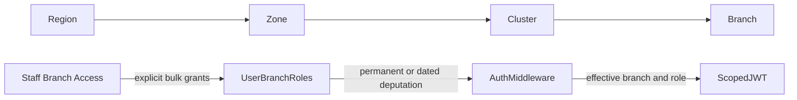

# SECURITY.md — Security Policy & Standards

> **Primary AI Role:** Security Architect
> **Status:** Living document. Extend, never rewrite (AGENTS.md Delete Safety Rule).

## 1. Purpose

Security policy for AuraShine: authentication, authorization, tenant isolation,
data protection, secrets, and vulnerability handling. Operational hardening steps
live in `docs/security-hardening.md`; the live permission matrix in `docs/permissions.md`.

## 2. Authentication

- Password-backed **JWT access tokens + refresh tokens**, plus OAuth where configured; refresh rotation on use.
- Sessions are tracked and revocable (session management tables); logout invalidates refresh tokens.
- Mobile clients authenticate against versioned `/api/v1` endpoints with device registration.
- Password storage: strong adaptive hashing; never log or echo credentials.
- OTP flows are rate-limited and expire quickly.
- Direct Python AI service endpoints require `Authorization: Bearer <AI_SERVICE_TOKEN>` except `/health`; production networking should keep the service private behind the Rust API.

## 3. Authorization

- **Deny by default.** Every endpoint requires an authenticated user and an explicit permission mapping.
- Roles: owner, manager, receptionist, staff, accountant, inventory manager, analyst, plus custom roles; platform-level `superAdmin` for the SaaS console (`x-user-role: superAdmin`).
- Enforcement is server-side middleware; the UI hides forbidden actions but is never the control.
- Protected actions (void/delete invoice, delete client, big discounts, exports, permission changes) require elevated permission **and** an audit log entry.
- Details: `RBAC.md`, `docs/permissions.md`, `docs/audit-log.md`.

## 4. Tenant Isolation (critical)

- Every tenant-owned table has `tenantId`; repositories scope **every** read/write.
- Tenant context: `x-tenant-id` header or verified domain mapping — then re-validated server-side against the authenticated user.
- Branch scoping via `x-branch-id`; staff/front-desk users are restricted to assigned branch ids server-side.
- Cross-tenant access of any kind is a **critical severity** bug. Guard tests: `tenant-safety.test.js`, `billing-tenant-isolation.test.js`.

## 5. Data Protection

- Money integrity: integer paise; payment truth from immutable payment rows.
- PII (phones, addresses, notes, consent forms, biometric captures) is role-gated and redacted from logs (`docs/logging.md`).
- Files stored outside the web root, served only through authorized endpoints (`docs/file-storage.md`).
- Backups are encrypted and never contain plaintext secrets (`BACKUP_RECOVERY.md`).

## 6. Secrets

- Secrets come from environment (`.env`, contract in `.env.example`) or encrypted settings — **never** hard-coded, committed, or logged.
- Tenant-level integration credentials (WhatsApp, Razorpay, SMS/email providers) are stored encrypted and scoped per tenant.
- API keys for the public API are hashed at rest, shown once at creation, rotatable without downtime (`docs/integrations-api.md`).
- API-client metadata requires `security.read`; create, rotate, and revoke require `security.manage` (or Owner/Admin/SuperAdmin).

## 7. Input & Transport

- All input validated at the route boundary (`backend-rust/src/routes` + validation middleware); prepared statements and bind parameters make injection structurally difficult — string-built SQL is forbidden.
- Rate limiting and API protection headers on all routes; stricter budgets on auth and OTP endpoints.
- Webhooks (Razorpay, WhatsApp, delivery reports) must verify signatures and deduplicate by event id before any write.
- HTTPS is mandatory in production; cookies/tokens never sent over plain HTTP.

## 8. Vulnerability Handling

- Report privately to the maintainers (repository owner) — do not open public issues for vulnerabilities.
- Triage SLA: critical 24h, high 72h, medium next release.
- Dependency hygiene: `npm audit` reviewed on a fixed cadence; criticals patched within SLA.

## 9. AI Instructions

- Never weaken an auth/tenancy/validation check to make a test pass.
- New endpoints must ship with auth + permission + validation + tenant scoping in the same change.
- Never print secrets or tokens in code, tests, logs or documentation examples.

## 10. Acceptance Criteria

- `security-shield.test.js`, `protected-actions.test.js`, `rbac.test.js`, `billing-security.test.js`, `billing-webhook-security.test.js` all pass.
- No secret material in the repository history.
- Every mutation endpoint appears in the permission matrix.

## 11. Future Roadmap

- Periodic penetration test checklist.
- Formal data-retention schedule per record class.
- Field-level encryption for the most sensitive PII.

## 12. OWASP Top 10 Coverage

| Risk | AuraShine control |
| --- | --- |
| Broken access control | JWT, RBAC, tenant/branch scope, deny-by-default permissions |
| Cryptographic failures | strong secrets, encrypted integration credentials, HTTPS |
| Injection | validators, named SQL params, no string-built SQL |
| Insecure design | protected-file boundaries, audit logs, approval gates |
| Security misconfiguration | security headers, CORS policy, production env checklist |
| Vulnerable components | dependency review and critical patch SLA |
| Auth failures | refresh rotation, revocation, lockout, rate limits |
| Integrity failures | signed webhooks, idempotency, immutable ledger rows |
| Logging failures | structured security audit logs and request ids |
| SSRF | outbound provider calls only through approved integration adapters |

## 13. Web, API, File, and Payment Security

- XSS: never render untrusted HTML unless sanitized by an approved path.
- CSRF: cookie-backed flows require CSRF protection; bearer-token APIs require
  strict CORS and authorization headers.
- File uploads: validate type, size, ownership, storage path, and download
  authorization.
- Webhooks: verify signatures, timestamp tolerance, replay id, and provider
  account/tenant mapping before writes.
- Payments: verify gateway signatures, store amounts in paise, reconcile
  provider status against local immutable payment rows.

## 14. Secrets, Password, and Encryption Policy

- Secrets live in environment or encrypted tenant settings.
- Passwords are hashed only; never stored, logged, emailed, or exported.
- Tenant integration credentials are rotatable and scoped to the tenant.
- Backup encryption keys are handled outside the repository.

## 15. Incident Response

1. Classify severity: critical, high, medium, low.
2. Preserve logs and affected request ids.
3. Disable affected integration or permission if containment is needed.
4. Patch with the smallest safe change.
5. Verify tenant isolation and regression path.
6. Document impact, fix, and follow-up hardening.

## 16. Security Checklist

- Auth required.
- Permission mapped.
- Tenant and branch scoped.
- Input validated.
- Safe error response.
- Audit event for protected action.
- No secret/PII leakage.
- Rate limit where abuse is possible.
- Webhook/payment actions idempotent.

## 17. MFA and Passkeys

- Authenticator MFA uses RFC 6238 TOTP. Secrets are encrypted at rest with
  `SECURITY_ENCRYPTION_KEY`; recovery codes are stored only as one-way hashes
  and are consumed atomically on first use.
- Owner, Admin, and finance scopes receive enrollment-only access until MFA is
  enabled. MFA cannot be disabled while the current scope requires it.
- Passkey ceremonies require `WEBAUTHN_RP_ID` and `WEBAUTHN_RP_ORIGIN`.
  Production origins must use HTTPS; plain HTTP is accepted only for localhost.
- Registration and authentication challenge state is stored server-side in
  PostgreSQL, expires after five minutes, and is deleted when consumed.
- Passkey credentials and challenge lookups are scoped by tenant and user.
  Successful passkey login enters the existing branch-selection and session
  issuance flow.
- MFA and passkey controls are available as authenticated self-service;
  security administration tabs remain permission-gated.
- Self-service endpoints are `/api/v1/auth/mfa/*` and
  `/api/v1/auth/webauthn/register/*`; public passkey login uses
  `/api/v1/auth/webauthn/login/*`.

## 18. Branch Hierarchy and Deputation

- Branch masters may carry Region, Zone, and Cluster metadata for owner search,
  filtering, and explicit bulk assignment across large chains.
- `user_branch_roles` remains the authorization source of truth. Hierarchy
  filters expand to explicit branch grants; role names never imply access.
- Permanent access may be the user's default branch. Deputation access requires
  an inclusive start/end business-date window and can never become default.
- Every authenticated request rechecks the branch grant. Scheduled deputation
  becomes effective on its start date and expires without relying on the JWT.
- Updating assignments revokes existing refresh sessions and increments the
  user's permission version through the existing authorization trigger.

## 19. Tamper-Evident Audit Chain

- Every `auth_audit_logs` insert is sealed automatically with a tenant-scoped
  SHA-256 chain. A locked tenant head row serializes concurrent audit writes.
- Sealed audit records are append-only; PostgreSQL rejects update and delete.
- `GET /api/v1/security/audit-chain/verify` verifies every stored hash and the
  tenant chain head. `POST /api/v1/security/audit-chain/seal` records a seal
  event and returns the fresh verification result.

## 20. Honeypot and Intrusion Detection

- High-confidence probes for exposed environment files, repository metadata,
  common admin consoles and path traversal are intercepted before routing.
- Every detection creates a tamper-evident audit event and a deduplicated
  security alert. Three probes within ten minutes trigger a one-hour Redis
  block and a matching durable blocklist record.
- Forwarded client IPs are trusted only when the immediate peer is a private or
  loopback proxy; direct public peers cannot spoof the automatic-block target.
- Authenticated probes stay tenant/branch scoped; anonymous probes appear in
  the SuperAdmin Security Center under the `platform/global` scope.

## 21. Device Security

- Device trust state is stored in `security_trusted_devices` and scoped by
  tenant, branch, user and `deviceId`.
- Active and historical device evidence comes from `auth_refresh_tokens`; no
  fabricated device records are created.
- Revoking a device immediately revokes its active refresh sessions and blocks
  future token issue/rotation for that `deviceId`.
- All-device sign-out revokes active refresh sessions for the selected user
  without marking every device as permanently revoked.

## 22. Privileged Sessions

- Sensitive actions can require a short-lived privileged session tied to the
  current tenant, branch, user and JWT `sessionId`.
- When MFA is enabled, step-up uses authenticator or recovery code. Otherwise,
  it uses current password verification.
- Privileged sessions expire after ten minutes and can be revoked by the user.
- Existing per-action MFA checks accept an active privileged session before
  asking for another code.

## 23. Field-Level Audit and Data Masking

- Role `masked_fields_json` remains the source of truth for response masking;
  security code must reuse it instead of adding one-off masking rules.
- Masked JSON responses record field-audit events with actor, request path,
  field group, field name, access type and reason.
- Masked roles are blocked from sensitive export paths, and blocked exports are
  also written to the field-audit ledger.
- `GET /api/security/field-audit` exposes recent tenant/branch-scoped field
  audit events for the Security Center.

## 24. Security Approvals and Access Rules

- Security approval requests are tenant and branch scoped, audited, and can be
  decided only once by a different security manager than the requester.
- IP access rules accept normalized IPv4 or IPv6 values with `allow`, `watch`,
  or `deny` effects. A deny rule requires a reason.
- Access-rule `deny` is a security risk signal; durable request blocking remains
  owned by the existing blocklist and intrusion-detection controls.
- Security Center uses `/api/security/approvals` and
  `/api/security/access-rules` for list, create, decision, and disable actions.

## 25. Adaptive and Emergency Access

- Browser authentication sends a stable opaque `deviceId`; refresh, passkey,
  branch-selection, and branch-switch flows reuse the same identifier.
- Password login risk combines known-device, known-IP, and rapid-IP-change
  evidence. High-risk login requires already-enrolled MFA and is audited.
- Temporary permissions require maker-checker approval, expire within 60
  minutes, remain branch scoped, and never override explicit role denies.
- Owner break-glass access requires an active privileged session, a reason,
  explicit permissions, and expires within 15 minutes. Activation and
  revocation are audited.
- The permission simulator reports base, temporary, denied, and final effective
  permissions without changing user access.
- Geographic impossible-travel enforcement requires a trusted GeoIP source;
  client-supplied coordinates are never accepted as a security signal.

The read-only `backend-rust/scripts/tenant-isolation-readiness.ps1` probe verifies
the real API rejects forged tenant and branch headers without creating business
records. Migration `0247_auth_tenant_branch_integrity.sql` audits canonical IDs
before adding composite tenant/user/branch/role foreign keys; all current
`user_branch_roles` repository reads and writes are tenant scoped. Native
PostgreSQL RLS remains a separate migration because enabling it requires
request-scoped transaction context on every pooled query.

## 26. Incident-Response Playbooks

- Incident playbooks are tenant and branch scoped and contain a stable key,
  severity, ordered checklist, status, creator, and timestamps.
- Playbook creation validates keys, severity, checklist size, step length, and
  duplicate steps. Create and disable actions are written to the audit chain.
- No sample incident records or automatic playbook rows are created; Security
  Center shows an empty state until an administrator saves a real playbook.
- Endpoints are `GET/POST /api/security/playbooks` and
  `POST /api/security/playbooks/:playbookId/disable`.

## 27. Privacy and Disclosure Requests

- Privacy requests and responsible-disclosure reports are durable PostgreSQL
  records scoped to the active tenant and branch.
- Privacy requests track subject, request type, requester, status and resolution;
  disclosure reports track reporter details, severity, status and resolution.
- Creation and resolution are permission-gated and written to the existing
  tamper-evident audit chain. No sample requests or reports are created.
- Endpoints are `GET/POST /api/security/privacy-requests`,
  `POST /api/security/privacy-requests/:requestId/resolve`,
  `GET/POST /api/security/disclosure-reports`, and
  `POST /api/security/disclosure-reports/:reportId/resolve`.

## 28. Compliance Evidence Export

- Security managers can export a tenant and branch scoped JSON evidence bundle
  for SOC 2 and ISO 27001 review from the existing Security Center.
- The bundle contains current security counts, MFA/governance counts, the
  verified audit-chain status, API-client/device/privileged-session evidence,
  field-audit and fraud counts, SSO policy counts, generation scope, timestamp,
  and exporter.
- Every export is recorded in the tamper-evident audit chain. The endpoint is
  `GET /api/security/compliance-evidence/export`.

## 29. Microsoft Entra ID, Google OIDC, and SAML Federation

- Google and Microsoft Entra ID use authorization-code flow with PKCE, signed
  ID-token validation, nonce/state checks, and one-time login handoffs.
- Enterprise SAML is accepted through a configured SAML-to-OIDC federation
  broker. AuraShine validates the broker issuer, JWKS signature, audience,
  nonce, PKCE state and verified user email before entering the same handoff.
- Provider credentials remain deployment secrets. Tenant policy only enables
  configured providers and selects Owner, Admin, or SuperAdmin enforcement.
- Enforced roles cannot use password or passkey login; denied attempts and
  policy changes are audited. Existing users are linked by verified email.
- Tenant policy is managed through `GET/PUT /api/security/sso-policy`; public
  login uses `/api/auth/sso/:provider/start`, callback, and exchange routes.

## 30. Accounting and Automation Connectors

- QuickBooks, Xero, NetSuite, and Google Calendar use OAuth 2.0 authorization
  code plus PKCE. Access and refresh tokens are encrypted with
  `SECURITY_ENCRYPTION_KEY` and never returned by list APIs.
- OAuth state is one-time, expires after ten minutes, and carries tenant,
  branch, actor, return-origin, and non-secret provider configuration.
- Connector checks run through durable retry jobs. Provider errors are reduced
  to safe status text; token bodies and upstream responses are never logged.
- Zapier reuses scoped, hashed API keys and signed HTTPS webhooks instead of
  storing a separate Zapier secret.
