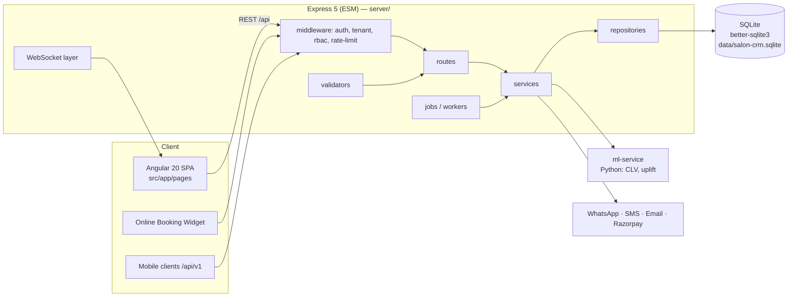
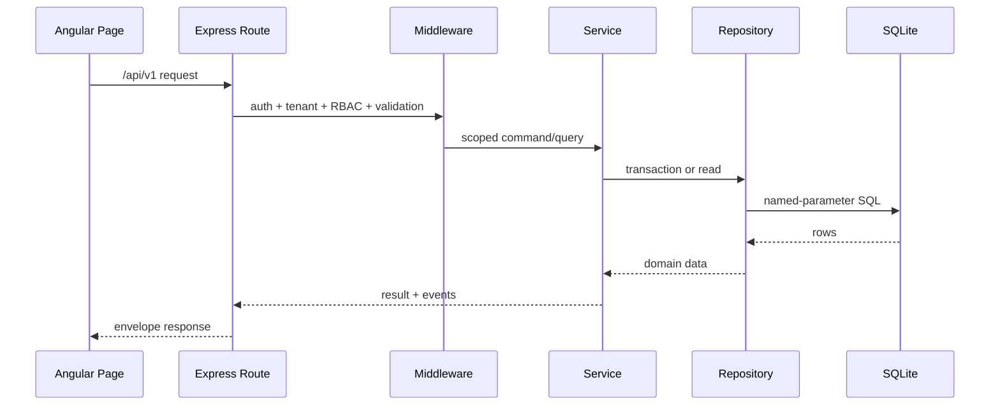
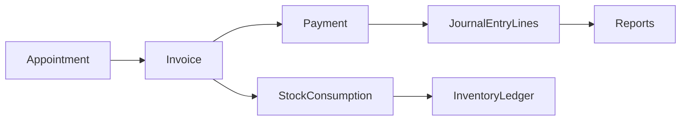

# ARCHITECTURE.md — AuraShine System Architecture

> **Primary AI Role:** Solution Architect
> **Status:** Living document. Extend, never rewrite (AGENTS.md Delete Safety Rule).

## 1. Purpose

Single authoritative description of how AuraShine (Aura Salon CRM/POS) is built:
components, layers, data flow, realtime model and the boundaries every change must respect.

## 2. System Overview

## 3. Components

| Component | Location | Notes |
| --- | --- | --- |
| Angular SPA | `src/app` | Standalone components, pages under `src/app/pages`, dev on :4300 with proxy to API |
| Express API | `server/` | ESM JavaScript only; entry `server/index.js` → `server/app.js`; serves built SPA in production |
| Data layer | `server/repositories` + `server/db.js` (protected) | All SQL lives here; named params; single SQLite file |
| Domain services | `server/services` | Business logic; protected: `smart-booking.service.js`, `booking-portal.service.js` |
| HTTP surface | `server/routes` (+ `controllers`) | Protected: `operations.routes.js`; one registration line per route file in `server/app.js` |
| Cross-cutting | `server/middleware`, `validators`, `utils`, `templates` | Auth, tenant resolution, RBAC, rate limiting, input validation |
| Async work | `server/jobs`, `server/workers` | Schedulers (idempotent), message dispatch, snapshots |
| Migrations | `server/migrations` | Sequential, additive-first, applied on boot |
| Realtime | WebSocket (`ws`) | Live bookings, dashboards, staff status, notifications, front-desk queue |
| ML sidecar | `ml-service/` | Python Flask-style app: `clv.py`, `uplift.py`; called via HTTP adapter with timeouts |
| Tests | `tests/` (vitest) | Feature-named suites; `scripts/run-tests.mjs` orchestrates |

## 4. Layering Rules (enforced)

1. **Route → Service → Repository.** Routes parse/validate/authorize; services hold business logic; repositories own SQL. No SQL in routes or services.
2. **Add-only / wrapper pattern.** New behaviour = new function or wrapper service; never rewrite existing services. Protected files are never edited.
3. **Single registration line** in `server/app.js` per new route module.
4. **Transactions** wrap every multi-write operation (better-sqlite3 sync transactions).
5. **Workers, not requests,** run long tasks (broadcasts, snapshots, exports).

## 5. Data Architecture

- One SQLite database (`data/salon-crm.sqlite`), WAL mode, created on API start.
- Every tenant-owned table carries `tenantId` + `branchId` (camelCase columns).
- Money stored as **integer paise**; dates as ISO strings, business dates in IST.
- Derived truths (payment status, balances, session counts) come from ledger rows, not mutable counters.
- Accounting: `journalEntryLines` is the source of truth; `balanceSheetSnapshots` archival only (see `docs/accounting.md`).
- Full rules: `DATABASE.md`. Tenancy design: `TENANT_ARCHITECTURE.md`.

## 6. Request Lifecycle

1. Request hits Express with `x-tenant-id`, `x-branch-id`, `x-user-role` + JWT.
2. Middleware: rate limit → auth (JWT/refresh) → tenant resolution (header or verified domain mapping) → RBAC permission check.
3. Validator checks the payload shape at the boundary.
4. Route calls a service; service composes repositories inside a transaction.
5. Envelope response returned (`API_GUIDELINES.md`); relevant WebSocket events broadcast; audit row written for protected actions.

## 7. Key Decisions (ADR summary)

| Decision | Rationale |
| --- | --- |
| SQLite + better-sqlite3 (sync) | Zero-ops single-file DB; sync transactions eliminate async race classes; fits salon-scale per-instance loads |
| ESM JavaScript backend (no TS) | Team velocity, minimal build step; typing pressure handled by validators + tests |
| Integer paise | Exact money math, no float drift; matches gateway (Razorpay) native unit |
| Header-based tenancy + server-side scoping | Simple clients; repositories re-enforce scope so forged headers can’t leak data |
| Wrapper/add-only evolution | Protects battle-tested booking/billing cores; keeps diffs reviewable |
| WebSocket for realtime | Front desk and calendar need push, not polling |

## 8. AI Instructions

- Never propose replacing any element of §7 — these decisions are locked (AGENTS.md).
- Place new code by §3’s table; follow §4 rules exactly.
- Diagram new flows in Mermaid within the relevant `docs/<domain>.md`.

## 9. Acceptance Criteria

- Any engineer/AI can locate the right layer for a change using §3–§4 alone.
- No PR introduces SQL outside repositories or edits a protected file.
- Architecture drift is corrected by updating this doc in the same PR.

## 10. Future Roadmap

- Add sequence diagrams for POS billing and booking flows.
- Document scaling path (per-tenant instance sharding) as tenant count grows.
- See also `docs/SYSTEM_BLUEPRINT.md` for the extended blueprint.

## 11. Enterprise Module Architecture

| Module | Frontend entry | Backend layer | Data truth | Notes |
| --- | --- | --- | --- | --- |
| Calendar/Appointments | `src/app/pages` calendar/booking pages | booking and appointment routes/services | appointments, booking events | Public booking wraps protected booking services. |
| POS/Billing | POS pages | billing, invoice, payment services | invoices, invoice payments, journal lines | Payment totals are paise. |
| Clients/CRM | client pages | client and customer intelligence services | clients, interactions, segments | PII is role-gated. |
| Staff/Payroll | staff pages | staff intelligence/payroll services | staff, shifts, payroll, statutory rows | Branch access is enforced server-side. |
| Inventory | inventory pages | inventory services/repositories | products, stock movements, transfers | WMA costing and stock ledgers are truth. |
| Accounting | finance pages | balance sheet, ledger, accrual services | `journalEntryLines` | Debit equals credit. |
| Reporting/Analytics | report/dashboard pages | report and analytics services | snapshots and source ledgers | Heavy calculations run as snapshots. |
| AI | AI/command pages | local AI plus provider adapter | `ai_interactions` | Local deterministic fallback stays available. |
| Notifications | engagement pages | WhatsApp/SMS/email/push services | notification rows and provider events | Webhooks are signed and idempotent. |
| SaaS Admin | super admin pages | SaaS/domain/tenant services | tenants, branches, subscriptions | Platform role required. |

## 12. Architecture Diagrams

### Request Flow

### Invoice Flow

## 13. Scalability, Caching, Backup, and DR

- Scale by keeping tenants isolated, queries indexed, and long jobs out of
  request paths.
- Cache only derived/read-heavy data with invalidation tied to source writes;
  never cache authorization decisions across users.
- Backup SQLite with online backup scripts and verify restores on schedule.
- Disaster recovery requires latest backup, environment secrets, deployment
  config, and a documented rollback point.

## 14. Integration Architecture

Third-party systems enter through route/service adapters. Webhooks validate
signatures, dedupe by provider event id, write audit/provider rows, then trigger
domain updates inside transactions.

## 15. Architecture Acceptance Criteria

- Every new feature names its owning module from §11.
- Any cross-module write documents the source of truth and transaction boundary.
- New architecture diagrams go in this file or the matching `docs/<domain>.md`.
