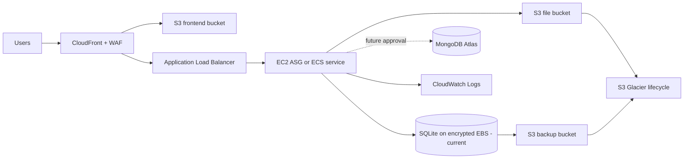

# AWS Architecture

## Scope

This plan deploys Aura Salon CRM/POS on AWS without changing application code. It is a documentation and configuration baseline only.

Current application invariant: backend is Express ES Modules with SQLite via `better-sqlite3`. MongoDB Atlas is listed in the requested target architecture, but using it as the primary application database requires explicit approval and application changes because the current repository is locked to SQLite. Until approved, production data remains SQLite and backups go to S3/Glacier.

## Target Services

| Layer | AWS service | Purpose |
| --- | --- | --- |
| Frontend | S3 private bucket + CloudFront | Host Angular static files and serve HTTPS traffic |
| Backend option A | EC2 Auto Scaling Group | Run Express API with persistent encrypted EBS for SQLite |
| Backend option B | ECS Fargate | Run containerized Express API; needs approved DB/file persistence design |
| Database current | SQLite on encrypted EBS | Current supported app database |
| Database future | MongoDB Atlas | Requires approved repository/service migration and data migration |
| File storage | S3 | Tenant-scoped uploads, exports, generated files |
| Backup | S3 + Glacier lifecycle | Database snapshots, file backups, restore evidence |
| Edge security | AWS WAF + CloudFront | Managed rules, rate limits, geo/IP controls |
| Runtime security | IAM + Secrets Manager + KMS | Least-privilege roles, encrypted secrets, encrypted storage |
| Monitoring | CloudWatch | Logs, metrics, alarms, dashboards |
| Scaling | ALB + Auto Scaling | Backend availability and controlled scale-out |

## High-Level Flow

## Network Layout

- One VPC across at least two Availability Zones.
- Public subnets: ALB, NAT Gateway if private egress is needed.
- Private subnets: EC2/ECS backend tasks.
- S3 access via VPC Gateway Endpoint where possible.
- Secrets Manager, CloudWatch Logs, ECR endpoints can be added for private egress control.
- MongoDB Atlas, if approved later, must use IP allowlist or PrivateLink.

## Frontend

- Build Angular with `npm run build`.
- Upload `dist/aura-salon-crm-pos/browser` or configured Angular output to a private S3 bucket.
- CloudFront uses Origin Access Control for S3.
- CloudFront routes `/api/*` to the backend ALB origin.
- SPA fallback maps 403/404 to `/index.html`.
- Production frontend uses `apiBaseUrl: /api/v1`, so same-domain CloudFront routing is preferred.

## Backend

### Option A: EC2 Recommended For Current SQLite

- ALB forwards `/api/*` and WebSocket upgrade traffic to EC2 instances.
- EC2 runs Node with `npm run start:prod` or a process manager approved later.
- Use encrypted EBS for `data/salon-crm.sqlite` and local working backups.
- Use single writer capacity unless an approved database migration is completed.
- Use Auto Scaling primarily for replacement/availability; do not run multiple independent SQLite writers against different disks.

### Option B: ECS Future Option

- ECS Fargate is suitable after the database persistence plan is approved.
- If SQLite remains primary, ECS needs an approved shared persistent storage/leader model; otherwise use EC2.
- If MongoDB Atlas is approved and implemented, ECS can scale horizontally behind ALB.

## Database Position

- Current: SQLite via `better-sqlite3`, file `data/salon-crm.sqlite`.
- Backups: `npm run backup:db` creates snapshots that are copied to S3 and transitioned to Glacier.
- Future MongoDB Atlas: document-only target until approved. Requires schema mapping, repository rewrite/wrapper strategy, migration scripts, tenant/branch scope verification, paise preservation, and rollback plan.

## File Storage

- S3 bucket per environment, for example `aura-prod-files`.
- Prefix layout: `tenantId/branchId/domain/yyyy/mm/<generated-file-name>`.
- No public object ACLs.
- Backend generates signed URLs only after auth and tenant checks.
- S3 SSE-KMS encryption enabled.

## Security Baseline

- IAM roles only; no static AWS keys on EC2/ECS.
- Secrets in AWS Secrets Manager, encrypted by KMS.
- WAF managed rules on CloudFront and optionally ALB.
- ALB security group accepts only CloudFront origin-facing ranges or approved admin CIDRs where feasible.
- Backend security group accepts only ALB traffic.
- S3 buckets block public access.
- CloudWatch logs enabled for ALB, API, WAF, and CloudFront standard logs if cost-approved.

## Cost-Control Notes

- Start with one NAT Gateway only for non-critical environments; production can use one per AZ if availability is required.
- Prefer S3 lifecycle rules over manual retention.
- Use CloudFront caching for static assets.
- Keep CloudWatch log retention finite, for example 30 to 90 days.
- Use t4g/t3 small EC2 instances for staging, then right-size from CloudWatch metrics.
- Use AWS Budgets with monthly threshold alarms.
